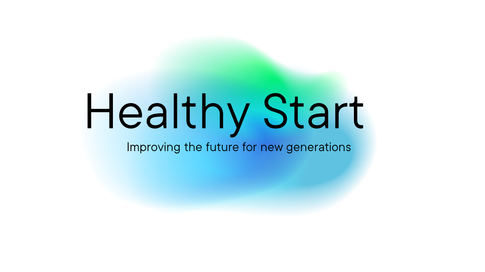

# fs_3dprint
# Code to convert FreeSurfer outputs into 3D-printable meshes. 

This code is heavily based on: https://github.com/miykael/3dprintyourbrain

The code is also heavily tailored for printing on BambuLab printers. 

What it will do:

1.) Convert the lh/rh surfaces into STL meshes

2.) Convert the non-cortical volume-based data into a single STL mesh

3.) Apply smoothing to the meshes, and also fix defects /issues with the meshes using pymeshlabs. 

4.) Merge all meshes together into a final STL file. 

Once the STL file is created, we have a template library for bambulab printers that vary parameters such as nozzel size, scale of print, filament type, etc. These are 3mf files which contain a standard geomtry STL. This geometry is replaced by your STL and re-saved as a 3mf / Gcode, which can then be loaded on the printer via USB. 

the code:

create_stl.py --> convert an FS output to STL

create_gcode.py --> updates a standard 3mf template with your STL geomtry for printing. 

Note, the create_gcode.py step is optional. you can load the STL onto a slicing software to re-size it, and slice it yourself if desired. For this you need orca-slicer or bambulabs GUI.   For create_gcode, we also have a singularity image which is required in order to use the orca-slicer command line interface. 

# This project was generously funded by the Health Start Sprint Project Touching Minds

https://convergence.nl/healthy-start/healthy-start-sprinters/healthy-start-sprinter-touching-minds/
